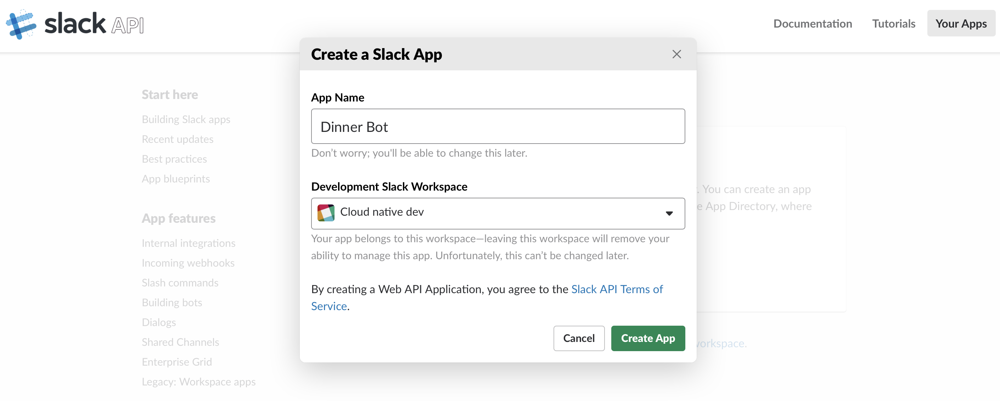

# IBM Client Developer Advocacy App Modernization Series

## Lab - Slack <-> Watson Assistant integration via Botkit on IBM Cloud Private

## Overview

The IBM's [Botkit middleware for Watson Assistant](https://github.com/watson-developer-cloud/botkit-middleware) allows developers to easily integrate a Watson Assistant workspace with multiple social channels like Slack, Facebook, and Twilio. Customers can have simultaneous, independent conversations with a single workspace through different channels.

In this lab you'll deploy a sample Node.js app that demonstrates  how the IBM Botkit middleware can be used to integrate Slack with a Watson Assistant skill. The app is a modified version of a sample app that comes with IBM's [Botkit middleware for Watson Assistant](https://github.com/watson-developer-cloud/botkit-middleware)

The modified version  is designed to be run on Kubernetes and is packaged as  a Helm chart that injects the required parameters as ENV vars into the container that runs the app.

### Step 1: Create a Slack application in a workspace

You'll need a Slack environment with a workspace for which  you have owner privileges. If you create a free Slack account with an email address that has not been used with Slack before, you'll be able to create a workspace and complete this lab. If you use an existing Slack account make sure you are the owner of an existing workspace or have the privileges to create your own workspace.

**Note:** Proceed to **Step 2: Create a Slack app** if you already have an existing Slack workspace with ownership privileges)

1. Create a free Slack account with an email address that has not been used with Slack before at https://slack.com **Note:** you'll have to validate your email address, create a workspace and create a channel as part of the workflow. You can name these whatever you like.

### Step 2: Create a Slack app

With Slack apps you can add external  bots to a workspace to give the users additional capabilities beyond those offered  via the Slack application.

1. From your Slack workspace in your browser click on the plus icon next to **Apps**

2. In the next screen click on **Manage Apps** (top left)

3. Click on **Build**

4. Click on **Start Building**

5. Name your app `Dinner Bot`, select your Slack workspace and click on **Create App**

6. Click on **Bots** in the **Add features and functionality** section

7. Click on **Add a Bot User**

8. Accept the defaults, click **Add Bot User** and then click on **Save Changes**

9. In the Navigation area on the left click on **OAuth & Permissions** and then click **Install App to Workspace**

10. Click **Authorize** when prompted.

11. Click on **Copy** next to the field labeled **Bot User OAuth Access Token** and paste this token into a text file. You'll need this later on in the lab.

12. In the Navigation area on the left click on **Basic Information**. Under **App Credentials** click on **Show** next to **Signing Secret** and copy this to the same text file that you used to save the Bot User Access Token.

13. Change the URL in your browser to `slack.com`, click on **Your workspaces** and then navigate to your workspace. Your app should be listed but the status indicator next to it will not be green because you haven't connected to it from an external bot.

### Step 3: Get your Watson Assistant skill credentials

You'll need the access credentials of the Watson skill that you're going to connect to the Slack  app you just created

1. Login to your IBM Cloud account at https://cloud.ibm.com

2. From the Dashboard click on **Services** in the **Resource summary** section

3. Click on your Watson Assistant instance under **Services**

4. Click on **Launch tool** to launch the Watson Assistant tooling and then click on **Skills** in the navigation area at the top

5. Click on the icon with the 3 periods arranged vertically in the tile for your DinnerBot skill and then select **View API details** from the context menu

6. Copy the **Workspace ID** and the **Password** values to the same text file you used for the Slack credentials. **Note:** The password will be referred to as the IAM apikey in later steps.

### Step 4: Deploy Botkit sample apps

Since the sample app is packaged as a Helm chart it can quickly deployed  via the IBM Cloud Private Web UI.

1. Login to the IBM Cloud Private Web UI

2. Click on **Catalog** in the navigation area at the top

3. On the left click on the **AI & Watson** Category

4. Click on the icon for the **k8s-watson-botkit-sample**

5. Click on **Configuration** and then enter the *Helm release name* as `usernn-botkit` where `usernn` is your ICP Web UI  username. Select your namespace in the dropdown for **Target namespace**]

6. Scroll down and paste in the corresponding values from the text file you used to save the credentials  into the fields for your WAtson Assistant IAM apikey, your Slack Bot User OAuth Token, your Slack Signing Secret and your Watson Assistant Workspace ID.

7. Click **Install** and the click on **View Helm Release** when prompted

## Step 5: Test integration with Slack

At this point you just need to verify that you can interact with your Watson Assistant skill from within Slack

1. Go back to your Slack workspace and verify that your **dinner_bot** app now appears with a green icon next to it signifying that the Botkit app has successfully connected to it.

2. From the Slack workspace select the **dinner_bot** app and then type in `Book a table` to start interacting with it. Verify you can go through the whole process of booking a reservation

## Summary

By using Botkit and the Watson Assistant middleware for Botkit you were able to demonstrate how to deploy a Kubernetes app that integrates Slack with Watson Assistant. The same technique can be used to integrate Watson Assistant with other environments like Facebook Messenger, Twilio and others with  Botkit support.
